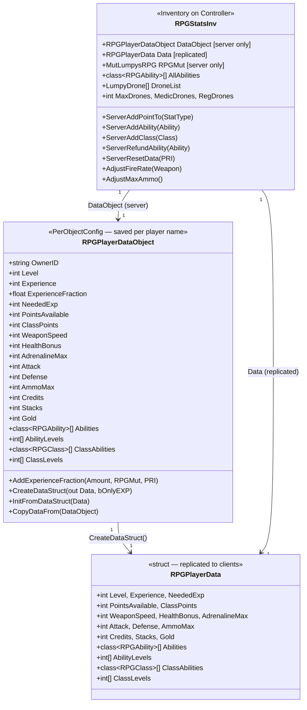

# LumpysRPG System — UML Reference

---

## 1. Core Architecture Overview

```
┌─────────────────────────────────────────────────────────────────────────┐
│                          GAME ENGINE (Server)                           │
│                                                                         │
│   MutLumpysRPG (Mutator)          RPGRules (GameRules)                  │
│   ┌──────────────────────┐        ┌──────────────────────┐              │
│   │ - Abilities[]        │◄──────►│ - NetDamage()        │              │
│   │ - XPBreakPoints[]    │        │ - ScoreKill()        │              │
│   │ - ModifyPlayer()     │        │ - AwardEXPForDamage() │              │
│   │ - SpawnDrone()       │        │ - ShareExperience()  │              │
│   │ - CheckLevelUp()     │        └──────────────────────┘              │
│   └──────────┬───────────┘                                              │
│              │ spawns & manages                                          │
│              ▼                                                           │
│   RPGStatsInv (Inventory on Controller)                                 │
│   ┌──────────────────────────────────────────────────────┐              │
│   │ Server: DataObject (RPGPlayerDataObject)             │              │
│   │ Both:   Data       (RPGPlayerData struct, replicated)│              │
│   │                                                      │              │
│   │ ServerAddPointTo()   ServerAddAbility()              │              │
│   │ ServerAddClass()     ServerRefundAbility()           │              │
│   │ AdjustFireRate()     AdjustMaxAmmo()                 │              │
│   └──────────────────────────────────────────────────────┘              │
└─────────────────────────────────────────────────────────────────────────┘
```

---

## 2. Class Hierarchy

```mermaid
classDiagram

    class Object {
    }

    class RPGAbility {
        <<abstract>>
        +string AbilityName
        +string Description
        +string MasterClass
        +bool bClassAbility
        +bool bMasterAbility
        +int StartingCost
        +int CostAddPerLevel
        +int MaxLevel
        +int BotChance
        +Cost(Data, CurrentLevel) int$
        +ModifyPawn(Other, AbilityLevel)$
        +UnModifyPawn(Other, AbilityLevel)$
        +ModifyWeapon(Weapon, AbilityLevel)$
        +HandleDamage(Damage, Injured, Instigator, ...)$
        +ScoreKill(Killer, Killed, bOwnedByKiller, Level)$
        +PreventDeath(...) bool$
        +AbilityIsAllowed(Game, RPGMut) bool$
    }

    class RPGClass {
        <<abstract>>
        extends RPGAbility
        note: bMasterAbility = true
    }

    class AbilitySpeed {
        <<abstract>>
        AbilityName = "Quickfoot"
        StartingCost = 10
        CostAddPerLevel = 5
        MaxLevel = 5
        Requirement: Level >= 10 * (CurrentLevel+1)
        +ModifyPawn() -- scales GroundSpeed/WaterSpeed/AirSpeed
    }

    class AbilityAmmoRegen {
        <<abstract>>
        StartingCost = 20
        CostAddPerLevel = 5
        MaxLevel = 15
        Requirement: AmmoMax >= 50
        +ModifyPawn() -- spawns AmmoRegenInv
        +UnModifyPawn() -- destroys AmmoRegenInv
    }

    class AbilityVampire {
        <<abstract>>
        StartingCost = 25
        CostAddPerLevel = 25
        MaxLevel = 10
        Requirement: Attack >= 50 * CurrentLevel
        +ModifyPawn() -- spawns VampireMarker
        +HandleDamage() -- heals 5% dmg per level
    }

    class AbilityGeneralVampire {
        <<abstract>>
        extends AbilityVampire
        note: Same logic, restricted to Monster damage
    }

    class AbilityDrones {
        <<abstract>>
        +ModifyPawn() -- calls RPGMut.SpawnDrone()
    }

    class AbilityAwareness {
        <<abstract>>
        +ModifyPawn() -- adds AwarenessInteraction
    }

    class AbilityShieldUpgrade {
        <<abstract>>
        +ModifyPawn() -- increases shield capacity
    }

    class AbilityFeatherFall {
        <<abstract>>
        +ModifyPawn() -- reduces fall damage
    }

    class AbilityInertialDampener {
        <<abstract>>
        +ModifyPawn() -- reduces momentum on damage
    }

    class AbilityHermesSandals {
        <<abstract>>
        +ModifyPawn() -- increases jump height
    }

    class AbilityJumpZ {
        <<abstract>>
        +ModifyPawn() -- scales JumpZ
    }

    class AbilitySpeedSwitcher {
        <<abstract>>
    }

    class ClassWeaponMaster {
        <<abstract>>
        AbilityName = "Weapon Master"
        MasterClass = (none set)
        bMasterAbility = true
        MaxLevel = 20
        note: NO ModifyPawn - STUB
    }

    class ClassMedicMaster {
        <<abstract>>
        AbilityName = "Medic Master"
        MasterClass = "MM"
        bMasterAbility = true
        MaxLevel = 20
        note: ModifyPawn commented out
    }

    class ClassAdrenalineMaster {
        <<abstract>>
        AbilityName = "Adrenaline Master"
        MasterClass = "AM"
        bMasterAbility = true
        MaxLevel = 20
    }

    class CA_MedicArtifacts {
        <<abstract>>
        bClassAbility = true
        MasterClass = "MM"
        MaxLevel = 5
        Artifacts: MedicWeaponMaker, SuperMedicWeaponMaker
        +ModifyPawn() -- gives artifact inventory items
    }

    class CA_MedicSprites {
        <<abstract>>
        bClassAbility = true
        MasterClass = "MM"
        MaxLevel = 5
        +ModifyPawn() -- calls SpawnDrone(..., class=1)
    }

    class CA_AdrenalineArtifacts {
        <<abstract>>
        bClassAbility = true
        MasterClass = "AM"
        MaxLevel = 1
        Artifacts: SuperMagicWM, MagicWM, Invuln, TripleDmg, Flight, LightningRod
        +ModifyPawn() -- gives artifact inventory items
    }

    Object <|-- RPGAbility
    RPGAbility <|-- RPGClass
    RPGAbility <|-- AbilitySpeed
    RPGAbility <|-- AbilityAmmoRegen
    RPGAbility <|-- AbilityVampire
    RPGAbility <|-- AbilityDrones
    RPGAbility <|-- AbilityAwareness
    RPGAbility <|-- AbilityShieldUpgrade
    RPGAbility <|-- AbilityFeatherFall
    RPGAbility <|-- AbilityInertialDampener
    RPGAbility <|-- AbilityHermesSandals
    RPGAbility <|-- AbilityJumpZ
    RPGAbility <|-- AbilitySpeedSwitcher
    RPGAbility <|-- CA_MedicArtifacts
    RPGAbility <|-- CA_MedicSprites
    RPGAbility <|-- CA_AdrenalineArtifacts
    AbilityVampire <|-- AbilityGeneralVampire
    RPGClass <|-- ClassWeaponMaster
    RPGClass <|-- ClassMedicMaster
    RPGClass <|-- ClassAdrenalineMaster
```



---

## 3. Player Data Model



### Key Data Fields Explained

| Field | Type | How it's used |
|---|---|---|
| `PointsAvailable` | int | Spent on general `Ability` upgrades (Speed, Vampire, etc.) |
| `ClassPoints` | int | Spent exclusively on `RPGClass` (master class) upgrades |
| `Abilities[]` | class<RPGAbility>[] | Parallel array — which general abilities the player has |
| `AbilityLevels[]` | int[] | `AbilityLevels[i]` is the level of `Abilities[i]` |
| `ClassAbilities[]` | class<RPGClass>[] | Which master classes chosen (up to 4 slots) |
| `ClassLevels[]` | int[] | `ClassLevels[i]` is the level of `ClassAbilities[i]` |
| `Attack` | int | Stat point — damage modifier; also gates some ability costs |
| `Defense` | int | Stat point — damage reduction |
| `WeaponSpeed` | int | Stat point — fire rate multiplier (`1.0 + 0.01 * WeaponSpeed`) |
| `HealthBonus` | int | Stat point — max health increase |
| `AdrenalineMax` | int | Stat point — max adrenaline |
| `AmmoMax` | int | Stat point — max ammo multiplier (`1.0 + 0.01 * AmmoMax`); gates AmmoRegen |

---

## 4. Ability Cost & Gating Pattern

All abilities follow this pattern in `Cost()`:

```unrealscript
// Base formula (in RPGAbility):
static simulated function int Cost(RPGPlayerDataObject Data, int CurrentLevel)
{
    if (CurrentLevel <= default.MaxLevel)
        return default.StartingCost + default.CostAddPerLevel * CurrentLevel;
    else
        return 0; // 0 means maxed/can't buy
}

// Subclass adds a REQUIREMENT gate — return 0 to block purchase:
// Example: AbilitySpeed — must be Level >= 10x the desired level
static simulated function int Cost(RPGPlayerDataObject Data, int CurrentLevel)
{
    if (Data.Level < 10 * (CurrentLevel + 1))
        return 0; // blocked — player isn't high enough level
    else
        return Super.Cost(Data, CurrentLevel); // 10 + 5*CurrentLevel
}

// Example: AbilityAmmoRegen — must have 50 AmmoMax stat
static simulated function int Cost(RPGPlayerDataObject Data, int CurrentLevel)
{
    if (Data.AmmoMax < 50)
        return 0; // blocked — insufficient stat investment
    else
        return Super.Cost(Data, CurrentLevel); // 20 + 5*CurrentLevel
}

// Example: AbilityVampire — must have Attack >= 50 per level
static simulated function int Cost(RPGPlayerDataObject Data, int CurrentLevel)
{
    if (Data.Attack < 50 * CurrentLevel)
        return 0; // blocked — not enough damage investment
    else
        return Super.Cost(Data, CurrentLevel); // 25 + 25*CurrentLevel
}
```

**Rule:** `Cost() == 0` means "cannot buy right now" (either maxed OR requirement not met).
The UI uses this to disable the Buy button. The distinction between "maxed" and "not met" is
only visible because `CurrentLevel >= MaxLevel` produces `0` via the base class naturally,
while a requirement gate also returns `0` but `CurrentLevel < MaxLevel`.

---

## 5. ModifyPawn / UnModifyPawn Pattern

`ModifyPawn` is called server-side from `MutLumpysRPG.ModifyPlayer()` whenever a player
spawns or refunds/buys an ability. It must be **idempotent** (safe to call multiple times).

```unrealscript
// Pattern A — Direct stat modification (stateless, safe to call repeatedly)
// Example: AbilitySpeed
static simulated function ModifyPawn(Pawn Other, int AbilityLevel)
{
    Other.GroundSpeed = Other.default.GroundSpeed * (1.0 + 0.05 * float(AbilityLevel));
    Other.WaterSpeed  = Other.default.WaterSpeed  * (1.0 + 0.05 * float(AbilityLevel));
    Other.AirSpeed    = Other.default.AirSpeed    * (1.0 + 0.05 * float(AbilityLevel));
    // Always sets from default.* so repeated calls are safe
}

// Pattern B — Inventory item injection (must check for existing item first)
// Example: AbilityAmmoRegen
static simulated function ModifyPawn(Pawn Other, int AbilityLevel)
{
    local AmmoRegenInv R;
    local Inventory Inv;

    if (Other.Role != ROLE_Authority)
        return; // server only

    // Remove old one first — handles level-up while alive
    Inv = Other.FindInventoryType(class'AmmoRegenInv');
    if (Inv != None)
        Inv.Destroy();

    R = Other.spawn(class'AmmoRegenInv', Other,,, rot(0,0,0));
    R.RegenAmount = AbilityLevel;
    R.GiveTo(Other);
}

// Paired UnModifyPawn — cleans up on refund
static simulated function UnModifyPawn(Pawn Other, int AbilityLevel)
{
    local Inventory Inv;
    if (Other.Role != ROLE_Authority) return;
    Inv = Other.FindInventoryType(class'AmmoRegenInv');
    if (Inv != None) Inv.Destroy();
}

// Pattern C — Actor spawn with external registry (Vampire)
// Example: AbilityVampire
static simulated function ModifyPawn(Pawn Other, int AbilityLevel)
{
    local VampireMarker Marker;
    local MutLumpysRPG RPGMut;

    if (Other.Role == ROLE_Authority && Other.Controller != None)
    {
        RPGMut = class'MutLumpysRPG'.static.GetRPGMutator(Other.Level.Game);
        Marker = GetMarkerFor(Other.Controller, RPGMut);
        if (Marker == None) // only spawn once
        {
            Marker = Other.spawn(class'VampireMarker', Other.Controller);
            Marker.PlayerOwner = Other.Controller;
            RPGMut.VampireMarkers[RPGMut.VampireMarkers.length] = Marker;
        }
        // Note: AbilityLevel used in HandleDamage, not here
    }
}
```

---

## 6. Class (Master Class) System

### Conceptual Flow

```
Player earns ClassPoints:
  - 10 at character creation (new player)
  - 50 on fresh reset (RPGStatsInv.InitNewPlayer)
  - +10 every 1000 levels

Player opens Character Tab → sees list of RPGClass abilities (bMasterAbility=true)
Player clicks "Add Class Point" → RPGTabCharacter.AddClassPoint()
  → StatsInv.ServerAddClass(SelectedClass)
    → Validates subclassing rules (see below)
    → Calls AddClass(SelectedClass, index)
      → DataObject.ClassAbilities[index] = SelectedClass
      → DataObject.ClassLevels[index]++
      → DataObject.ClassPoints -= Cost
    → MutLumpysRPG.ModifyPlayer() re-runs to apply new class level effects
```

### Subclassing Rules (ServerAddClass logic)

```
ClassAbilities.length == 0:
    → Free slot, buy any class as first class

ClassAbilities.length == 1:
    → If player.Level < 1000: can ONLY upgrade existing class (no new classes)
    → If player.Level >= 1000: can pick a SECOND different class (subclass)

ClassAbilities.length == 2:
    → Can upgrade either existing class freely
    → To add a THIRD: at least one of the two must be at MaxLevel (20)

ClassAbilities.length == 3:
    → Can upgrade any existing class freely
    → To add a FOURTH: at least one of the three must be at MaxLevel (20)

ClassAbilities.length == 4+:
    → Can only upgrade existing classes, no new ones
```

### Class Ability (CA_) Pattern

Class abilities (`bClassAbility=true`, `MasterClass="MM"`) are the per-class abilities
that appear in the general ability list but are only meaningful when the player has the
matching master class. The `MasterClass` string links them to their parent class.

```unrealscript
// Example: CA_AdrenalineArtifacts — grants artifact inventory on ModifyPawn
class CA_AdrenalineArtifacts extends RPGAbility abstract;

defaultproperties
{
    bClassAbility = true
    MasterClass   = "AM"    // links to ClassAdrenalineMaster
    MaxLevel      = 1
    StartingCost  = 1

    // Artifacts given to the player:
    Artifacts(0) = Class'LumpysRPG.ArtifactSuperMagicWeaponMaker'
    Artifacts(1) = Class'LumpysRPG.ArtifactMagicWeaponMaker'
    Artifacts(2) = Class'LumpysRPG.ArtifactInvulnerability'
    Artifacts(3) = Class'LumpysRPG.ArtifactTripleDamage'
    Artifacts(4) = Class'LumpysRPG.ArtifactFlight'
    Artifacts(5) = Class'LumpysRPG.ArtifactLightningRod'
}

// ModifyPawn gives each artifact if the player doesn't already have it:
static simulated function ModifyPawn(Pawn Other, int AbilityLevel)
{
    local int x;
    if (Monster(Other) != None) return;
    for (x = 0; x < default.Artifacts.length; x++)
        giveArtifact(Other, default.Artifacts[x]);
}
```

### Current Class State Summary

| Master Class | MasterClass key | ModifyPawn | Class Abilities |
|---|---|---|---|
| `ClassWeaponMaster` | *(none set)* | **STUB — nothing** | **None exist** |
| `ClassMedicMaster` | `"MM"` | Commented out | `CA_MedicArtifacts`, `CA_MedicSprites` |
| `ClassAdrenalineMaster` | `"AM"` | None needed (passive) | `CA_AdrenalineArtifacts` |

---

## 7. XP & Leveling Flow

```
Monster takes damage from player
  → RPGRules.AwardEXPForDamage()
      XP = (Damage / Monster.HealthMax) * Monster.Score
      → RPGPlayerDataObject.AddExperienceFraction(XP, RPGMut, PRI)
          ExperienceFraction += XP
          if ExperienceFraction >= 1.0:
              Experience += floor(ExperienceFraction)
              → RPGMut.CheckLevelUp(data, PRI)

Monster is killed
  → RPGRules.ScoreKill()
      → awards bonus kill XP (1 point per monster Score value)
      → each ability's ScoreKill() is called

CheckLevelUp():
  while Experience >= NeededExp:
      Level++
      PointsAvailable += PointsPerLevel   ← stat points to spend
      Experience      -= NeededExp
      NeededExp        = GetNeededXP(Level) ← XPBreakPoints[] table lookup
      if Level % 1000 == 0:
          ClassPoints += 10               ← class points awarded at milestones
      spawn LevelUpEffect on pawn
      broadcast GainLevelMessage
```

**XP Breakpoints** are configured in `LumpyRPG.ini` as an array:
```ini
[LumpysRPG.MutLumpysRPG]
XPBreakPoints=(Level=1,XPRequired=100)
XPBreakPoints=(Level=10,XPRequired=500)
XPBreakPoints=(Level=50,XPRequired=2000)
; etc.
```
`GetNeededXP()` finds the highest breakpoint `<= current level` and returns its `XPRequired`.

---

## 8. Ability Registration (LumpyRPG.ini)

Abilities are **not auto-discovered**. They must be listed in `LumpyRPG.ini`:

```ini
[LumpysRPG.MutLumpysRPG]
Abilities=Class'LumpysRPG.AbilitySpeed'
Abilities=Class'LumpysRPG.AbilityJumpZ'
Abilities=Class'LumpysRPG.AbilityHermesSandals'
Abilities=Class'LumpysRPG.ClassAdrenalineMaster'   ; bMasterAbility=true → shows in Character tab
Abilities=Class'LumpysRPG.ClassWeaponMaster'        ; bMasterAbility=true
Abilities=Class'LumpysRPG.ClassMedicMaster'         ; bMasterAbility=true
Abilities=Class'LumpysRPG.CA_MedicArtifacts'        ; bClassAbility=true, MasterClass="MM"
Abilities=Class'LumpysRPG.CA_MedicSprites'          ; bClassAbility=true, MasterClass="MM"
Abilities=Class'LumpysRPG.CA_AdrenalineArtifacts'   ; bClassAbility=true, MasterClass="AM"
Abilities=Class'LumpysRPG.AbilityAwareness'
Abilities=Class'LumpysRPG.AbilityDrones'
Abilities=Class'LumpysRPG.AbilityAmmoRegen'
Abilities=Class'LumpysRPG.AbilitySpeedSwitcher'
Abilities=Class'LumpysRPG.AbilityGeneralVampire'
Abilities=Class'LumpysRPG.AbilityShieldUpgrade'
```

On startup, `MutLumpysRPG` calls `AbilityIsAllowed(Game, RPGMut)` on each.
If it returns `false`, the ability is moved to `RemovedAbilities[]` and shown as unavailable.
Adding a new ability requires: 1) the `.uc` file, 2) a compiled `.u`, 3) an entry here.

---

## 9. Damage Pipeline (HandleDamage)

```
RPGRules.NetDamage(Damage, Injured, Instigator, ...)
    │
    ├── Apply Attack/Defense stat modifiers
    │   Damage *= (1.0 + 0.01 * Instigator.Attack)
    │   Damage *= (1.0 - 0.01 * Injured.Defense)
    │
    ├── For each ability of INJURED player:
    │       ability.HandleDamage(Damage, Injured, Instigator,
    │                            ..., bOwnedByInstigator=false, Level)
    │
    └── For each ability of INSTIGATOR:
            ability.HandleDamage(Damage, Injured, Instigator,
                                 ..., bOwnedByInstigator=true, Level)

// Example: AbilityVampire uses bOwnedByInstigator to only trigger for the attacker
static function HandleDamage(out int Damage, Pawn Injured, Pawn Instigator, ...,
                              bool bOwnedByInstigator, int AbilityLevel)
{
    if (!bOwnedByInstigator) return; // only fire for the one who dealt damage
    if (DamageType == class'DamTypeRetaliation') return; // no leeching off retaliation
    if (Injured == Instigator) return; // no self-healing

    // Heal 5% of damage per level
    Health = int(float(Damage) * 0.05 * float(AbilityLevel));
    Instigator.Health += Health;
    Marker.HealthRestored += Health; // VampireMarker caps it in Tick()
}
```

---

## 10. Adding a New Ability — Checklist

To add a new general ability (e.g. `AbilityRegeneration`):

1. **Create** `LumpysRPG/Classes/AbilityRegeneration.uc`
   ```unrealscript
   class AbilityRegeneration extends RPGAbility abstract;

   static simulated function int Cost(RPGPlayerDataObject Data, int CurrentLevel)
   {
       if (Data.HealthBonus < 25 * CurrentLevel) // requirement gate
           return 0;
       return Super.Cost(Data, CurrentLevel);
   }

   static simulated function ModifyPawn(Pawn Other, int AbilityLevel)
   {
       // spawn/configure an inventory item that ticks HP regen
   }

   static simulated function UnModifyPawn(Pawn Other, int AbilityLevel)
   {
       // destroy that inventory item
   }

   defaultproperties
   {
       AbilityName    = "Regeneration"
       Description    = "Ability Name: Regeneration|..."
       StartingCost   = 15
       CostAddPerLevel = 10
       MaxLevel       = 5
   }
   ```

2. **Recompile** `LumpysRPG.u` via `ucc make`

3. **Register** in `System/LumpyRPG.ini`:
   ```ini
   Abilities=Class'LumpysRPG.AbilityRegeneration'
   ```

To add a new **class ability** (e.g. for WeaponMaster):

1. Create `CA_WeaponBonus.uc` extending `RPGAbility` with `bClassAbility=true`, `MasterClass="WM"`
2. Set `MasterClass` on `ClassWeaponMaster` to `"WM"`
3. Register both in `LumpyRPG.ini`
4. Recompile

---

## 11. Replication Summary

```
Server                              Client
──────                              ──────
RPGPlayerDataObject (authoritative)
RPGStatsInv.DataObject
         │
         │  RPGPlayerData struct
         │  (replicated bNetDirty)  ──────────────► RPGStatsInv.Data
         │                                          (read-only, drives HUD/menus)
         │
         │  ServerAddAbility()      ◄────────────── Player clicks Buy
         │  ServerAddClass()        ◄────────────── Player clicks Add Class Point
         │  ServerAddPointTo()      ◄────────────── Player spends stat point
         │
         │  ClientAddAbility()      ──────────────► Updates Data.Abilities locally
         │  ClientUpdateStatMenu()  ──────────────► Refreshes stat menu display
         │  ClientAdjustFireRate()  ──────────────► Applies WeaponSpeed to current weapon
```

**Key constraint:** `ModifyPawn()` marked `simulated` runs on both sides.
Server runs it authoritatively; client runs it for immediate visual feedback.
Anything that spawns actors (AmmoRegenInv, VampireMarker, drones) must guard
with `if (Other.Role != ROLE_Authority) return;` to prevent double-spawning.
